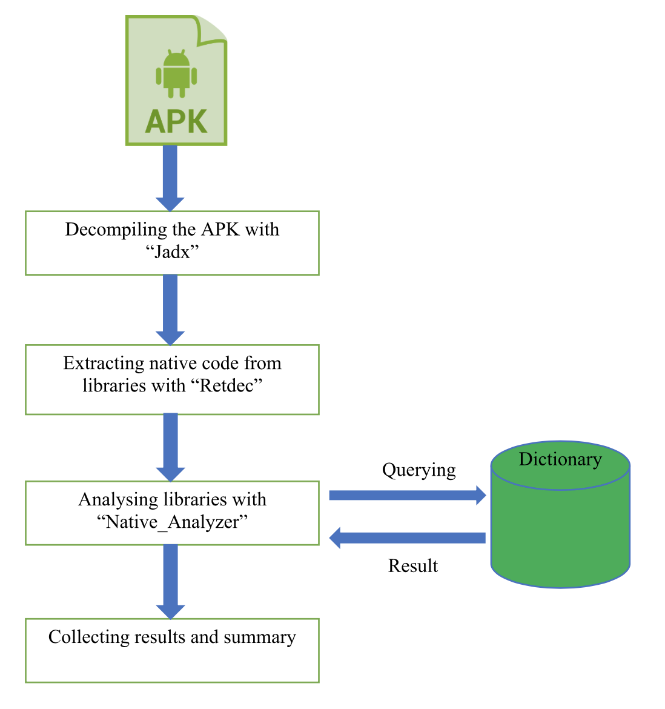
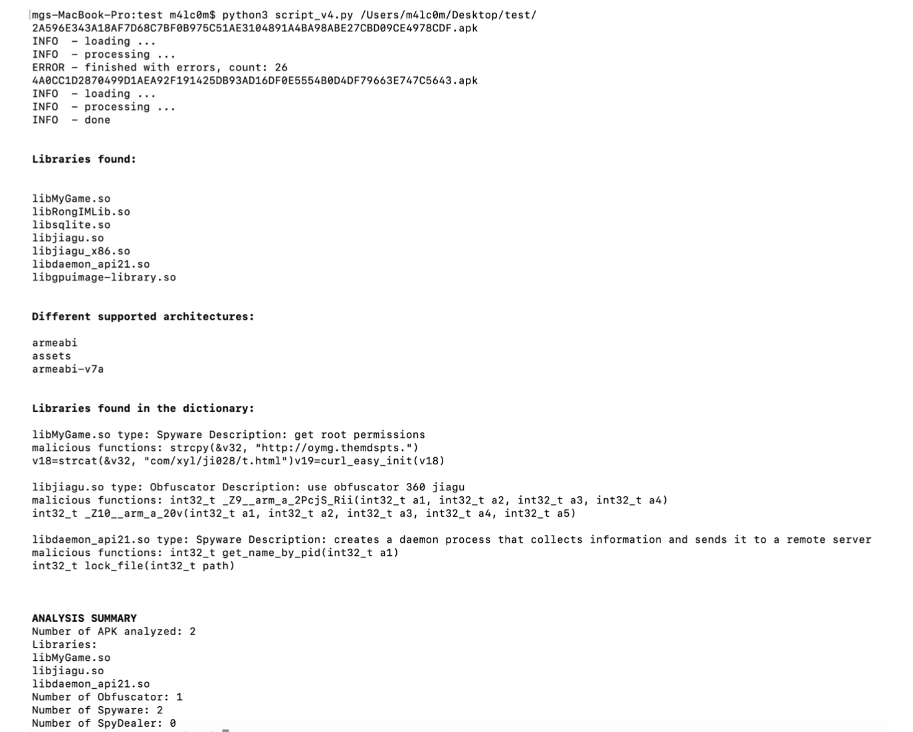

# Python Script for Android Native code analysis

Script python for analysis of Android native libraries. It base on a dictionary search.

---

## Table of Contents (Optional)

- [Documentation](#Documentation)
- [Analysis](#Analysis)
- [Run](#Run)
- [Support](#Support)

---
## Documentation

> Python version: 3.7

> python -> [download](https://www.python.org/downloads)

> Jadx

---

## Analysis

### Decompile APK

> Decompiling is done through the jadx tool that generates the jar for each apk

> jadx -> [download](https://github.com/skylot/jadx)

### Libraries Extraction

> Then there is the extraction of the native libraries present in the lib and asset folders.

### Search in dictionary

> Finally the libraries are then compared with a dictionary (diz.py)

### Result

---

## Run

> Run the script with `python3 native_analyzer.py /path/apk_name.apk`

## Support

Reach out to me at one of the following places!

- Email at `girolamo.musto@gmail.com`</a>
- Email at `emanuele.pri9@gmail.com`</a>
